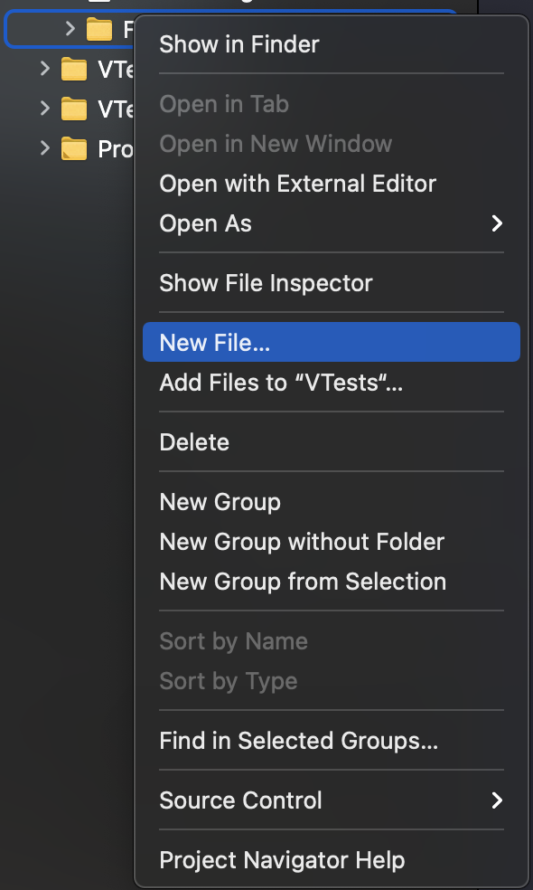
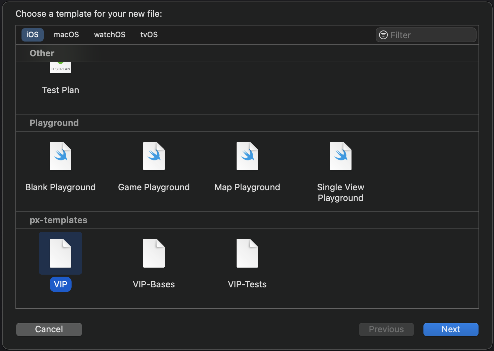
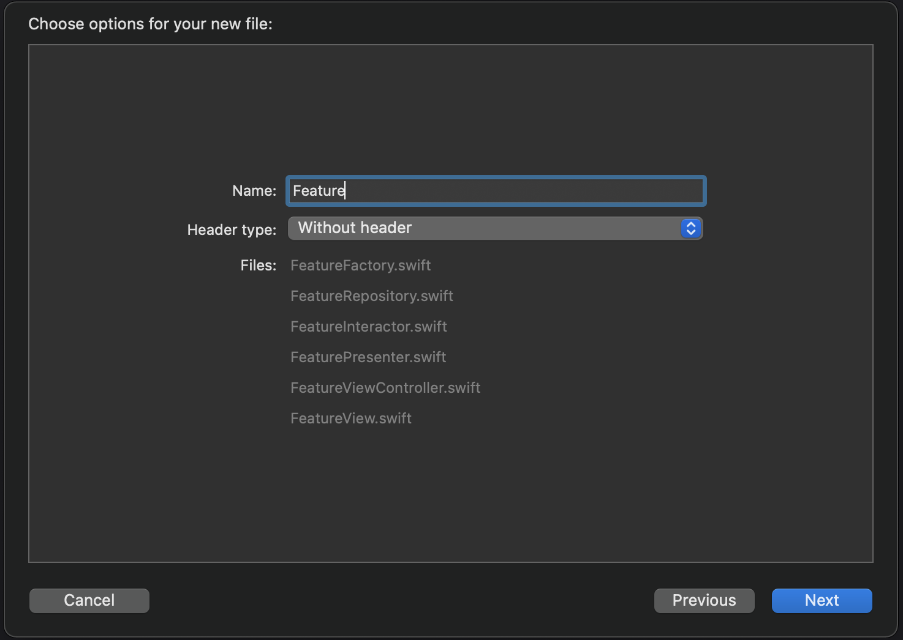

# PX-Templates

- Architectures: 
    - VIP 

## Installation

```bash
mkdir -p ~/Library/Developer/Xcode/Templates/;cp -r px-templates ~/Library/Developer/Xcode/Templates/
```

## Update

```bash
rm -rf ~/Library/Developer/Xcode/Templates/px-templates;mkdir -p ~/Library/Developer/Xcode/Templates/;cp -r px-templates ~/Library/Developer/Xcode/Templates/
```

## Uninstallation

```bash
rm -rf ~/Library/Developer/Xcode/Templates/px-templates
```

## Usage

<div style="text-align: center">
    
</div>
- Right click and select New File...
<br><br>

<div style="text-align: center">
    
</div>

- Select in **px-templates** the template with the desired name
- Click next
<br><br>

<div style="text-align: center">
    
</div>
- Type the name of the feature, the final name of the generated files will be shown
- Click next
- Click create